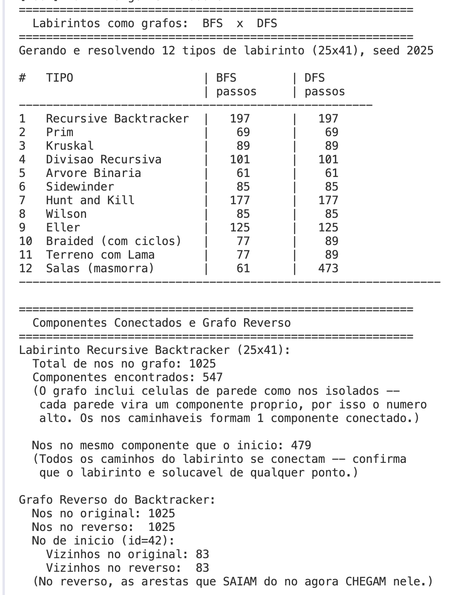

# G5_Grafos_EDA2-2026.1

# Grafos — BFS e DFS

Número da Lista: G5  
Conteúdo da Disciplina: Grafos

## Alunos

| Matrícula | Aluno |
| -- | -- |
| 23/1011696 | Luiz Guilherme Morais da Costa Faria |
| 23/1030771 | Henrique F G Passos |

## Sobre

Este projeto implementa grafos aplicados à resolução de labirintos,
demonstrando na prática dois algoritmos clássicos de busca: BFS (Busca
em Largura) e DFS (Busca em Profundidade).

Cada célula caminhável do labirinto é mapeada para um nó do grafo, e
cada passagem entre células vizinhas vira uma aresta. Resolver o
labirinto é, portanto, o mesmo problema que encontrar um caminho entre
dois nós em um grafo.

O projeto implementa do zero todas as estruturas de dados utilizadas
(VetorDinamico, Fila e Pilha), sem depender da biblioteca padrão do
C++. Também implementa Componentes Conectados e Grafo Reverso como
extensões do trabalho.

São gerados 11 tipos diferentes de labirinto (Recursive Backtracker,
Prim, Kruskal, Divisão Recursiva, Árvore Binária, Sidewinder, Hunt and
Kill, Wilson, Eller, Braided e Salas), permitindo comparar o
comportamento dos algoritmos em diferentes estruturas de grafo.

## Vídeo de Apresentação

(a ser adicionado)

## Screenshots

### Estrutura do Projeto


### Grafo — Lista de Adjacência


### BFS — Busca em Largura


### DFS — Busca em Profundidade


### Componentes Conectados


### Grafo Reverso


### Resultado no Terminal


## Instalação

Linguagem: **C++ 17**  
Build system: **CMake 3.16+**

### Pré-requisitos

- CMake 3.16 ou superior
- Compilador C++ com suporte a C++17 (AppleClang, GCC ou Clang)

### Passos

**1. Clone o repositório:**
```bash
git clone https://github.com/eda2-2026/G5_Grafos_EDA2-2026.1.git
cd G5_Grafos_EDA2-2026.1
```

**2. Crie a pasta de build e compile (sem visualização gráfica):**
```bash
mkdir build
cd build
cmake .. -DWITH_SFML=OFF -DCMAKE_CXX_COMPILER=/usr/bin/clang++
cmake --build .
```

**3. Execute o programa:**
```bash
./MazeSolver
```

**4. Opcional — compile com visualização gráfica animada (requer download da SFML):**
```bash
mkdir build
cd build
cmake .. -DWITH_SFML=ON -DCMAKE_CXX_COMPILER=/usr/bin/clang++ -DCMAKE_C_COMPILER=/usr/bin/clang
cmake --build .
./MazeSolver
```

**Controles da animação:**
- `← →` — troca o tipo de labirinto
- `1` / `2` — BFS / DFS
- `R` — reinicia a animação
- `+` / `-` — aumenta / diminui a velocidade
- `ESC` — sair

## Uso

Ao executar o programa, ele automaticamente:

1. Gera 11 tipos de labirinto com seed fixa (2025)
2. Resolve cada um com BFS e DFS
3. Exibe tabela comparativa com número de passos de cada algoritmo
4. Demonstra Componentes Conectados e Grafo Reverso no primeiro labirinto

## Estrutura do Projeto

```
src/
├── main.cpp
├── include/
│   ├── Algoritmos/
│   │   ├── AlgoritmoDeBusca.h
│   │   ├── BFS.h
│   │   ├── DFS.h
│   │   ├── ComponentesConectados.h
│   │   └── GrafoReverso.h
│   ├── EstruturasDeDados/
│   │   ├── VetorDinamico.h
│   │   ├── Fila.h
│   │   └── Pilha.h
│   ├── Grafo/
│   │   └── Grafo.h
│   ├── Labirinto/
│   │   ├── Labirinto.h
│   │   └── MazeGenerator.h
│   └── Utils/
│       └── Timer.h
└── Visualization/
    └── MazeRenderer.cpp
```